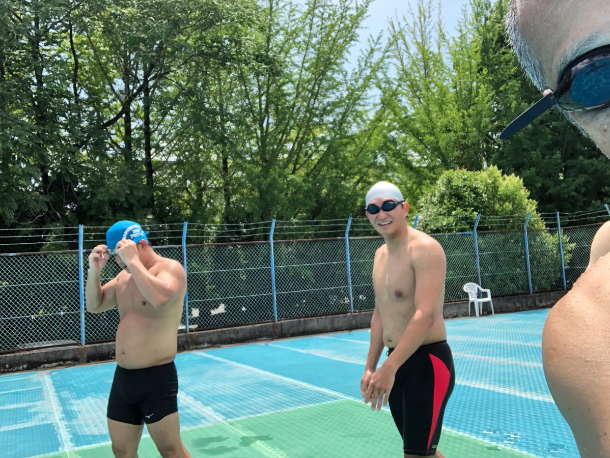

# 20220724_ekihigashi_pool

<html>
<head>

<meta charset="UTF-8">
<meta http-equiv="Content-Type" content="text/html; charset=UTF-8">
<meta http-equiv="X-UA-Compatible" content="IE=EmulateIE10" />
<meta http-equiv="X-UA-Compatible" content="IE=edge">

<!--ここから上はお決まりの定型文です-->

<!--ここからが表現の書式などを決めるcssという部分-->

<link href="https://cdnjs.cloudflare.com/ajax/libs/lightbox2/2.7.1/css/lightbox.css" rel="stylesheet">

</head>

<body>

 
	

  モバイル端末をお使いの場合は、画面を横向きにすると
  より見やすくご覧頂けます。

    

<a href="https://dorikawa.github.io/20210704_Utsunomiya_swim/">20210704_Utsunomiya_swim</a>><a href="https://dorikawa.github.io/20220626_Utsunomiya_swim/">2022年宇都宮市民大会</a>>20220724_駅東公園プール撮影会><a href="https://dorikawa.github.io/swim/">水の上を走れ</a>

	

 アクセス用QRコード

<marquee direction="left" scrollamount="20" width="30%">(^_^)/~hada</marquee>

<h1><marquee behavior="alternate">!!! 2022/09/17,18,19 栃木国体競泳 !!!</marquee></h1>

 
17日、成年男子、１００バタ（栃木県の水沼選手が優勝）。

<iframe width="560" height="315" src="https://www.youtube.com/embed/KW6KxgQrkGk" title="YouTube video player" frameborder="0" allow="accelerometer; autoplay; clipboard-write; encrypted-media; gyroscope; picture-in-picture" allowfullscreen></iframe>

 
18日、成年女子、１００フリー。

<iframe width="560" height="315" src="https://www.youtube.com/embed/MbbYicaN4Us" title="YouTube video player" frameborder="0" allow="accelerometer; autoplay; clipboard-write; encrypted-media; gyroscope; picture-in-picture" allowfullscreen></iframe>

 
19日、成年女子、4００メドレーリレー。

<iframe width="560" height="315" src="https://www.youtube.com/embed/QLDrF1Zk270" title="YouTube video player" frameborder="0" allow="accelerometer; autoplay; clipboard-write; encrypted-media; gyroscope; picture-in-picture" allowfullscreen></iframe>

  

<h1><marquee behavior="alternate">!!! 2022/07/24 駅東公園プール、動画撮影会 !!!</marquee></h1>

 
ドリームかわちメンバーが撮影会を開催しました。
	
 
ビデオ撮影は吉澤修平さん、HP立ち上げは羽田が担当しました。

	

  
とりあえず、各自の泳ぎYoutubeリンクです。

 
最初の動画は見本とすべき浜田さんの泳ぎ。視聴後のご本人コメントが届きました。 「捩じりも前後の伸びも不足しているのがよくわかりました。」

<iframe width="560" height="315" src="https://www.youtube.com/embed/kmaZ2h14z-g" title="YouTube video player" frameborder="0" allow="accelerometer; autoplay; clipboard-write; encrypted-media; gyroscope; picture-in-picture" allowfullscreen></iframe>

<iframe width="560" height="315" src="https://www.youtube.com/embed/NN_8WhxYfRc" title="YouTube video player" frameborder="0" allow="accelerometer; autoplay; clipboard-write; encrypted-media; gyroscope; picture-in-picture" allowfullscreen></iframe>

<iframe width="560" height="315" src="https://www.youtube.com/embed/fiWAT2i1mBg" title="YouTube video player" frameborder="0" allow="accelerometer; autoplay; clipboard-write; encrypted-media; gyroscope; picture-in-picture" allowfullscreen></iframe>

<iframe width="560" height="315" src="https://www.youtube.com/embed/GnJo2uZIk2U" title="YouTube video player" frameborder="0" allow="accelerometer; autoplay; clipboard-write; encrypted-media; gyroscope; picture-in-picture" allowfullscreen></iframe>

<iframe width="560" height="315" src="https://www.youtube.com/embed/VrAeh51-Dtg" title="YouTube video player" frameborder="0" allow="accelerometer; autoplay; clipboard-write; encrypted-media; gyroscope; picture-in-picture" allowfullscreen></iframe>

<iframe width="560" height="315" src="https://www.youtube.com/embed/1mnLCTA3ikk" title="YouTube video player" frameborder="0" allow="accelerometer; autoplay; clipboard-write; encrypted-media; gyroscope; picture-in-picture" allowfullscreen></iframe>

<iframe width="560" height="315" src="https://www.youtube.com/embed/acLBDOG1mUI" title="YouTube video player" frameborder="0" allow="accelerometer; autoplay; clipboard-write; encrypted-media; gyroscope; picture-in-picture" allowfullscreen></iframe>

<iframe width="560" height="315" src="https://www.youtube.com/embed/EzyNS1OQ6-k" title="YouTube video player" frameborder="0" allow="accelerometer; autoplay; clipboard-write; encrypted-media; gyroscope; picture-in-picture" allowfullscreen></iframe>

<iframe width="560" height="315" src="https://www.youtube.com/embed/bMmt6lb0n0g" title="YouTube video player" frameborder="0" allow="accelerometer; autoplay; clipboard-write; encrypted-media; gyroscope; picture-in-picture" allowfullscreen></iframe>

<iframe width="560" height="315" src="https://www.youtube.com/embed/wP_J1VcuReI" title="YouTube video player" frameborder="0" allow="accelerometer; autoplay; clipboard-write; encrypted-media; gyroscope; picture-in-picture" allowfullscreen></iframe>

<iframe width="560" height="315" src="https://www.youtube.com/embed/1h3GGC9k6tw" title="YouTube video player" frameborder="0" allow="accelerometer; autoplay; clipboard-write; encrypted-media; gyroscope; picture-in-picture" allowfullscreen></iframe>

  
羽田は体内感覚に反して、肩が前に伸びてなく、入水した手が下がってます。 キックは左右の足が離れ過ぎてボロボロ〜。

<iframe width="560" height="315" src="https://www.youtube.com/embed/0d9qNDZZWgc" title="YouTube video player" frameborder="0" allow="accelerometer; autoplay; clipboard-write; encrypted-media; gyroscope; picture-in-picture" allowfullscreen></iframe>

<iframe width="560" height="315" src="https://www.youtube.com/embed/c6_hgUd8_qU" title="YouTube video player" frameborder="0" allow="accelerometer; autoplay; clipboard-write; encrypted-media; gyroscope; picture-in-picture" allowfullscreen></iframe>

<iframe width="560" height="315" src="https://www.youtube.com/embed/dChODnvezqM" title="YouTube video player" frameborder="0" allow="accelerometer; autoplay; clipboard-write; encrypted-media; gyroscope; picture-in-picture" allowfullscreen></iframe>

  
 
撮影会の光景。

  
小5のジュリちゃんは年齢制限で50mプールに入れず、プールサイドで見学。

  
<h1><marquee behavior="alternate">!!! 2022/07/31 駅東公園プール、フラダンス !!!</marquee></h1>

<iframe width="560" height="315" src="https://www.youtube.com/embed/1diri7Q6Yoc" title="YouTube video player" frameborder="0" allow="accelerometer; autoplay; clipboard-write; encrypted-media; gyroscope; picture-in-picture" allowfullscreen></iframe>

<iframe width="560" height="315" src="https://www.youtube.com/embed/k54G-qYefbs" title="YouTube video player" frameborder="0" allow="accelerometer; autoplay; clipboard-write; encrypted-media; gyroscope; picture-in-picture" allowfullscreen></iframe>

<!--
<h2><a href="https://dorikawa.github.io/20220626_Utsunomiya_swim/" target="_blank" rel="noopener noreferrer">2022年市民大会へのリンクです。</a></h2>
<h2><a href="https://dorikawa.github.io/20210704_Utsunomiya_swim/" target="_blank" rel="noopener noreferrer">2021年市民大会へのリンクです。</a></h2>
-->
                             

	
  
おまけ、背景原画

                                              

<!-- フッタ -->
 <footer>
 Copyright 2022/07/24 S.Hada
 </footer>

<!--HPにさまざまなJavaScriptを呼び込むための書式-->

</body>

</html>
